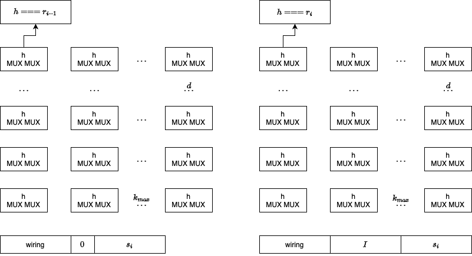
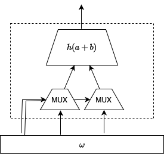

# Trustless SMT accumulator

This is the base data structure for implementing Unicity's aggregation layer.

By using an appropriate cryptographic SNARK, the size of proof can be reduced to constant size. Proving time depends on the logarithm of capacity and max. addition batch size.

## Definitions

Trustless append only accumulator is consistent, if during insertion of a batch of updates there were no changes or deletions of existing leaves. The data structure implements other usual functions like inclusion proofs and non-inclusion proofs.

The size of consistency proof depends on the size of addition batch and logarithm of capacity. If we denote batch size as $k$ and depth $d$, then size of consistency proof is $O(k \cdot d)$, where $d \approx \log(capacity)$.

By using a cryptographic SNARK (a zero knowledge proof with certain properties), the size of consistency proof can be further reduced to constant size.

After every addition batch, the root of aggregation layer is certified by the BFT Finality Gadget, ensuring its uniqueness and immutability. This provides a useful trust anchor for consistency proofs, inclusion proofs, and non-inclusion proofs.

## Proof of Consistency

We have $i$th batch of insertions $B = (k_1, k_2, \dots, k_j)$, where $k$ is an inserted item; all executed during a round of operation. Root hash before the round is $r_{i-1}$, and after the round is $r_i$. The accumulator is implemented as a Sparse Merkle Tree (SMT).

The consistency proof generation for batch $B_i$ works as follows:

*  Insert the new SMT leaves in $B_i$,
*  Starting from the newly inserted leaves, for each sibling hash necessary to compute the root of the tree, we record sibling's path and sibling's value as the proof. Let's denote the set as $s_i$.
*  Record $(B_i, r_{i-1}, r_i, s_i)$.

Proof verification works as follows:

*  authenticate $r_{i-1}, r_i$
*  Build an incomplete SMT tree: for each item in $B_i$, we insert the value of empty leaf at appropriate position,
*  All necessary siblings necessary to compute the root are available in $s_i$. Compute the root, compare with $r_{i-1}$, if not equal then proof is not valid.
*  Build again an incomplete SMT tree, for each item in $B_i$, we insert the value of each key into appropriate position.
*  Compute the root based on siblings in $s_i$. If root is not equal to $r_i$ then proof is not valid.
*  Proof is valid if the checks above passed.

This shows that given authentic $r_{i-1}, r_i$, the keys in $B_i$ were empty before the insertion batch, and after execution of insertion batch the values in $B_i$ were recorded at the positions defined by respective keys, and there were no other changes.


## SNARK based Proof of Consistency

Statement to be proved is the verification algorithm sketched above. Instance is defined by the root of trust and insertions, $I = ((r_i, r_{i-1}),B_i)$. Witness $\omega = (s_i)$ is the secret in zero knowledge, but for our use-case, it is not necessary to keep the witness secret.

The statement is implemented as a constraint system $R$ using the CIRCOM domain specific language. The witness is generated based on $s_i, B_i$, and supplemented by control wires defining how individual hashing blocks in the circuit are connected to the previous layer and to the inputs. If all constraints are satisfied, then the proof is valid.

The proving backend is Groth 2016\footnote{\url{https://eprint.iacr.org/2016/260}} with conveniently small proof size. The proving time depends on the depth of SMT and the maximum size of the insertion batch. Importantly, the proving effort does not depend on the total size/capacity of SMT, enabling fairly large instantiations.

If the layer above verifies proofs of consistency, then Unicity aggregation layer is trustless. Still, some redundancy (at least one node able to persist the data structure) is required for data availability.

## Circuit Design

Preprocess the proof:

1. flatten the SMT (hash forest containing proof + addition batch) to the left (root is up)
1. sort by layers, leaves first, and then lexicographically
1. add 'wiring' signal fed into muxes before each hasher node.

Let's denote maximum batch size $k_{max}$, SMT depth $d$.

Circuit has two halves, both controlled by the same wiring signal. First half connects all insertion batch indices to zero (the empty element), second half to actual input values in the batch.
First half computes to the root hash before insertion batch. Second half -- after.

Sise of each half is $k_{max} \cdot d$

Every following hashing layer connects inputs either to an output from previous layer, or element from proof.

Wiring signal is a pre-computed part of witness and does not have to be public. This is a lots of wires, let's see the effect on proving time.



Each cell above is implemented as a template with 2 muxes and a 2:1 hasher:



The leaf layer, first half mux inputs are connected to a vector with

1. 'empty' leaf ($0$)
1.  all the new leaves in the batch are connected to 'empty' ($0$)
1. 'proof' or sibling hashes ($s_i$)

The leaf layer, second half mux inputs are connected to a vector with

1. 'empty' leaf ($0$)
1. batch of new leaves ($I$)
1. identical 'proof' or sibling hashes ($s_i$)

Internal layers' muxes are connected to a vector a with

1. 'empty' leaf
1. previous layer cell output hashes,
1. 'proof' or sibling hashes ($s_i$)

Both halves' muxes are controlled by the same wiring signal. The positions of batch elements and proof elements are encoded into the control wires during the pre-processing, that is, control signals are part of the witness.

## Walkthrough

#### Install circom, snarkjs, optionally [rapidsnark](https://github.com/iden3/rapidsnark)
See https://docs.circom.io/getting-started/installation/


#### Generate the circuit

```sh
circom ndproof.circom --O2 --r1cs --wasm --c
```

> [!NOTE]
> generated c code works on amd64 only; wasm based witness generation is slow!

> [!NOTE]
> generated wasm code works up to a certain circuit size


#### Perform the trusted setup ceremony (depends on circuit)
See https://docs.circom.io/getting-started/proving-circuits/

> [!NOTE]
> the degree 12 there is ok for trivial circuits. $2^{\mathsf{degree}}$ should be larger than the number of constraints, as output by the next command.

Example for ~5 million constraints. Appropriate to run over a weekend.
```sh
export NODE_OPTIONS="--max-old-space-size=8192"
snarkjs powersoftau new bn128 23 pot23_0000.ptau -v
snarkjs powersoftau contribute pot23_0000.ptau pot23_0001.ptau --name="First contribution" -v -e="blaah"
snarkjs powersoftau prepare phase2 pot23_0001.ptau pot23_final.ptau -v
# following is circuit specific
snarkjs groth16 setup ndproof.r1cs pot23_final.ptau ndproof_0000.zkey
snarkjs zkey contribute ndproof_0000.zkey ndproof_0001.zkey --name="1st Contributor Name" -v -e="blablaah"
snarkjs zkey export verificationkey ndproof_0001.zkey verification_key.json
```

#### Produce input
```sh
pip3 install -r reqirements.txt
python3 ndsmt.py > input.json
```
#### Witness generation
```sh
snarkjs wtns calculate ndproof_js/ndproof.wasm input.json witness.wtns
```

or alternatively (x86 only):
```sh
cd ndproof_cpp
make
./ndproof ../input.json ../witness.wtns
```

#### Prove
```sh
# increase nodejs limits for large circuits
export NODE_OPTIONS="--max-old-space-size=8192"
snarkjs groth16 prove ndproof_0001.zkey witness.wtns proof.json public.json
```

#### Prove using rapidsnark

```sh
prover ndproof_0001.zkey witness.wtns proof.json public.json
```

#### Verify
```sh
snarkjs groth16 verify verification_key.json public.json proof.json
```


## Optimization ideas

- [x] Special mux with 2 outs and multiplexed control (minor effect on number of wires, removed)
- [x] Quin Selector instead of circomlib's mux (negative effect, removed)
- [ ] multiplex control wire signals within a layer (TBD the effect: removes wires, but adds gates)
- [x] Unlike depicted above, layers close to the root have $1, 2, 4, 8, \dots, k_{max}$ cells
- [ ] It is possible to pack in more inputs than $k_{max}$ if some inputs share hashing steps at the leaf layer (ie, are connected to the same cell), that is, dynamic batch size to fully fill the width of circuit (up to batch generator)
- [ ] Reduce depth ($d$), ie, use indexed Merkle tree with fixed max. capacity instead of complete SMT
- [ ] Greater arity than 2?
- [ ] Remove the special hashing rule h(0, 0) -> 0 -- then at each non-leaf layer, "empty" element is not zero and has to be hardcoded
- [ ] Split up the input proof: left half, right half, maybe even/odd layers, etc; so that less wide muxes can be used. If the tree is well populated then proofs gets larger, than currently configured.

# License

MIT
