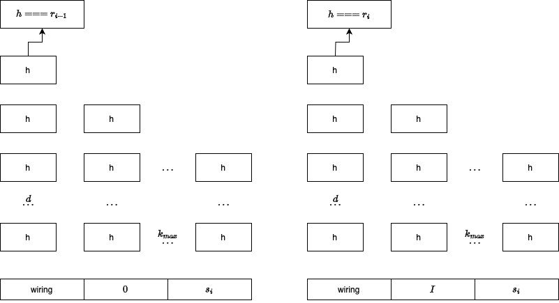

# Trustless SMT accumulator

Trustless addition only accumulator, that is, a Sparse Merkle Tree with cryptographic consistency proof, consistency meaning that during a batch of updates, there were no changes or deletions of existing leaves.

This is the base data structure for implementing Unicity's aggregation layer.

By using an appropriate cryptographic SNARK, the size of proof can be reduced to constant size. Proving time depends on the logarithm of capacity and max. addition batch size.

# Proof of Non-deletion (sketch)

## Without SNARK

We have a batch of SMT insertions $B_i = (k_1, k_2, \dots, k_j)$, where $k$ is an inserted key, executed during a round of operation. SMT root hash before the round is $r_{i-1}$, and after the round is $r_i$; these values are certified by the BFT finality gadget and can be verified as authentic.

   - Let's take the SMT after insertion round:
   - We record all new additions $B_i$,
   - We record all sibling hashes $s_i$ (roots of subtrees not containing new additions) of the data structure, so that $r_i$ can be computed based on recorded data. Also, decorate the siblings with their positions in SMT.
   - Let's take the SMT before the insertion round:
   - We mark siblings recorded during the previous step (note that they haven't changed) in the SMT
   - We record all other missing siblings $s_i'$ so that $r_{i-1}$ can be computed based on marked siblings and "missing siblings". (record their positions as well).

Proof is a tuple of two sets $(s_i, s_i')$. For proof verification we need $r_i, r_{i-1}$ (authentic trust anchors) and $(s_i, s_i')$ and $B_i$.

In order to prove non-deletion, we show that:

1. $r_{i-1}$ can be computed based on recorded data $(s_i, s'_i)$,
1. $r_i$ can be computed based on recorded data $(s_i, B_i)$,
1. During both computations, sibling hashes $s_i$  are the same.

This proves that on assumption that $r_i, r_{i-1}$ are authentic, only keys within $B_i$ were added, the rest did not change.

## With SNARK

Statement is the verification algorithm above,

Instance is defined by the root of trust and insertions, $I = ((r_i, r_{i-1}),B_i)$,

Witness $\omega = (s_i, s'_i)$ and we do not have to keep it secret.

Let's represent the Statement (verification algorithm) as a constraint system $R$ (using e.g. CIRCOM language, with $\omega$ as private input signals and $I$ public). SNARK is defined by the following functions:

$$\begin{align*}
(CRS, ST) &\gets \mathsf{Setup}(R, \lambda) \\
      \pi &\gets \mathsf{Prove}(R, CRS, I, \omega) \\
 \{1, 0\} &\gets \mathsf{Verify}(R, CRS, I, \pi) \\
      \pi &\gets \mathsf{Sim}(R, CRS, ST,I)
\end{align*}$$

($ST$ is thrown away after the setup ceremony)

## Circuit

Preprocess the proof:

1. flatten the SMT (hash forest containing proof + addition batch) to the left (root is up)
1. sort by layers, leaves first, and then lexicographically
1. add 'wiring' signal fed into muxes before each hasher node.

Let's denote maximum batch size $k_{max}$, SMT depth $d$.

Circuit has two halves, both controlled by the same wiring signal. First half connects all insertion batch indices to zero (the empty element), second half to actual input values in the batch.
First half computes to the root hash before insertion batch. Second half -- after.

Sise of each half is $k_{max} \cdot d$

Every following hashing layer connects inputs either to an output from previous layer, or element from proof.

Wiring signal is a pre-computed part of witness and does not have to be public. This is a lots of wires, let's see the effect on proving time.

Each cell above is implemented as a template with 2 muxes and a 2:1 hasher:

The leaf layer, first half mux inputs are connected to a vector with

1. 'empty' leaf ($0$)
1. 'proof' or sibling hashes ($s_i$)

The leaf layer, second half mux inputs are connected to a vector with

1. batch of new leaves ($I$)
1. identical 'proof' or sibling hashes ($s_i$)

Internal layers' muxes are connected to a vector a with

1. previous layer cell output hashes,
1. 'proof' or sibling hashes ($s_i$)

Both halves' muxes are controlled by the same wiring signal. The positions of batch elements and proof elements are encoded into the control wires during the pre-processing.

# License
MIT